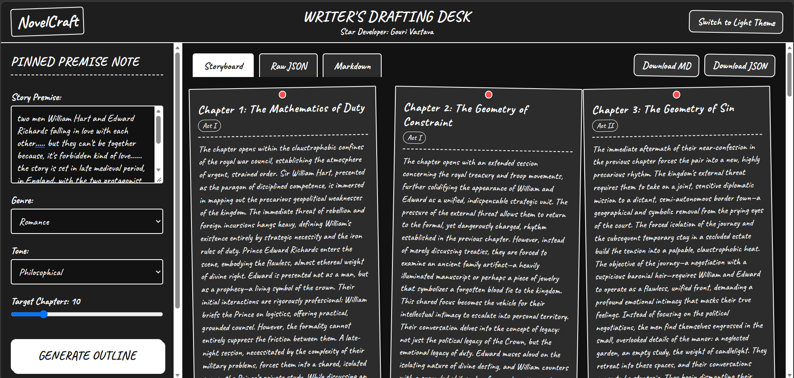
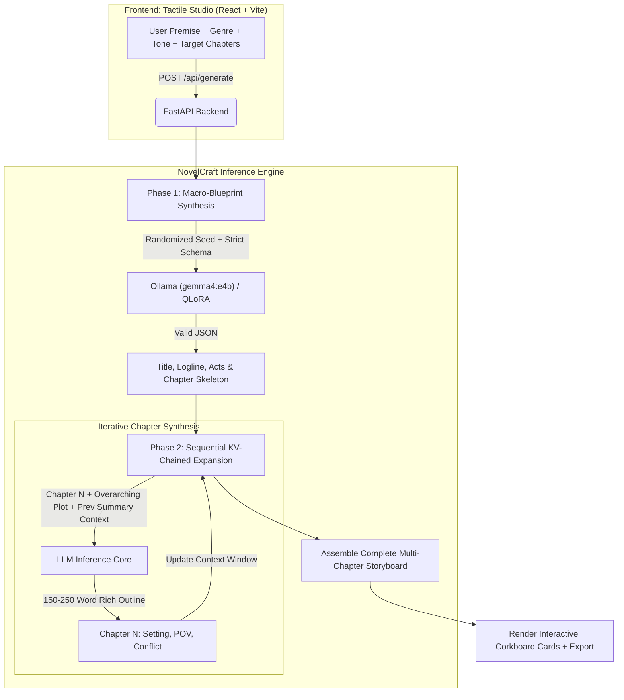

<div align="center">

# 📖 NovelCraft — Tactile AI Novel Outline Studio
### *Distributed Narrative Intelligence • Dramatic Act Synthesis • QLoRA & Ollama Engine*

[](./LICENSE)
[](https://www.python.org/)
[](https://fastapi.tiangolo.com)
[](https://react.dev)
[](https://vitejs.dev)
[](https://ollama.com)
[](https://www.docker.com/)
[](./CONTRIBUTING.md)

<p align="center">
  <b>NovelCraft</b> is an open-source, full-stack generative AI storytelling assistant that transforms short premises into deeply structured, chapter-by-chapter novel outlines. Grounded in classical dramatic acts (Three-Act / Hero's Journey), it employs a <b>Two-Phase Distributed Chaining Method</b> to eliminate LLM response limits and maintain 100% narrative continuity.
</p>

[✨ Live Preview](#-tactile-studio-interface) • [🚀 Quick Start](#-quick-start) • [🧠 Architecture](#-architecture--distributed-generation) • [📊 Comparison](#-benchmark--comparison) • [📖 API Reference](./docs/API_REFERENCE.md) • [💬 FAQ](#-frequently-asked-questions-aeo)

</div>

---

## 📸 Tactile Studio Interface

<div align="center">
  
  <p><i>Figure 1: NovelCraft Tactile Outline Studio — Featuring Cabin Sketch typography, high-contrast corkboard cards, POV/Setting/Conflict infobars, and Dramaturgy notes.</i></p>
</div>

---

## 🌟 Why NovelCraft? (SEO & AEO Highlights)

Most LLM story generators fail because asking a model for 20 chapters at once produces compressed, 1-sentence outlines with rampant character amnesia. **NovelCraft** re-engineers long-form narrative synthesis from the ground up:

- ✍️ **Two-Phase Distributed Chaining**: Bypasses LLM output token limits by synthesizing a macro-blueprint first, then sequentially expanding each chapter with previous-chapter memory context.
- 🎭 **Classical Dramatic Act Pacing**: Enforces Three-Act structure (*Departure, Initiation/Complication, Resolution*), identifying Inciting Incidents, Midpoint Climaxes, and Dark Nights of the Soul.
- 🎨 **Tactile Hand-Drawn UI**: Retro corkboard aesthetic with authentic *Cabin Sketch* cross-hatched typography, pure white light mode, and dark slate mode.
- 🤖 **Dual Inference Pipeline**: Connect directly to remote **Ollama** nodes (`gemma4:e4b` on LAN) or run local 4-bit **QLoRA** (`Qwen2.5-1.5B/3B`).
- 📁 **Multi-Format Export**: Instant export to Markdown (`.md`), Raw JSON Schema, or copyable storyboards.
- ⚡ **1-Click Local Execution**: Launch everything on Windows with a single double-click on `run_app.bat`.

---

## 🧠 Architecture & Distributed Generation



For comprehensive mathematical and fine-tuning details (QLoRA $r=16, \alpha=32$, RLHF PPO alignment), see **[docs/ARCHITECTURE.md](./docs/ARCHITECTURE.md)**.

---

## 🚀 Quick Start

### Option 1: 1-Click Windows Launcher (Fastest)

Simply double-click **[`run_app.bat`](./run_app.bat)** in the root directory!

The script automatically:
1. Creates Python `venv` and installs backend dependencies.
2. Installs frontend `node_modules` (if missing).
3. Launches the **FastAPI Backend** (`http://localhost:8000`).
4. Launches the **React Vite Frontend** (`http://localhost:5173`).
5. Opens your default browser to the Tactile Studio.

---

### Option 2: Docker Compose (Cross-Platform)

```bash
# Clone the repository
git clone https://github.com/your-username/novel-outline-generator.git
cd novel-outline-generator

# Start both services
docker-compose up --build
```
- **Studio Web UI**: `http://localhost:5173`
- **Backend Swagger Docs**: `http://localhost:8000/docs`

---

### Option 3: Manual Local Setup

```bash
# 1. Setup Backend
python -m venv venv
# On Windows: venv\Scripts\activate | On Linux/macOS: source venv/bin/activate
pip install -r requirements.txt
cd backend
python -m uvicorn main:app --reload --host 0.0.0.0 --port 8000

# 2. Setup Frontend (in a separate terminal)
cd frontend
npm install
npm run dev
```

---

## 🌐 Remote Ollama Node Configuration

To power NovelCraft using your dedicated GPU or LAN server running Ollama (e.g. at `http://192.168.0.102:11434` with `gemma4:e4b`):

1. On your Ollama host, enable LAN listening:
   ```bash
   # Windows PowerShell:
   $env:OLLAMA_HOST="0.0.0.0:11434"; ollama serve
   # Linux:
   OLLAMA_HOST=0.0.0.0:11434 ollama serve
   ```
2. Pull your model: `ollama pull gemma4:e4b`
3. In NovelCraft, open the **Ollama Node & Sampling Params** accordion and set your IP and model.

---

## 📊 Benchmark & Comparison

| Feature | NovelCraft (This Project) | Standard LLM Prompting | General ChatGPT Plus |
| :--- | :---: | :---: | :---: |
| **Pacing Architecture** | **3-Act Dramatic Continuity** | Linear / Monotonous | Unstructured |
| **Token Limit Defeat** | **Distributed Chaining** | Truncated / Compressed | Short Summaries |
| **Narrative Consistency** | **KV Memory Chained** | Hallucinates / Forgets | High Context Drift |
| **Tactile Visual Studio** | **Interactive Corkboard UI** | Raw Markdown Text | Chat Message Wall |
| **Privacy & Self-Hosting**| **100% Local / Remote Ollama** | Closed Cloud API | Closed Cloud API |
| **Multi-Format Export** | **Markdown (.md), JSON, Visual** | Manual Copy-Paste | Manual Copy-Paste |
| **Open Source License** | **AGPL-3.0 (True Freedom)** | Proprietary | Proprietary |

---

## 📁 Repository Structure

```text
novel_outline_generator/
├── .github/                           # CI/CD Workflows, PR & Issue Templates
│   ├── workflows/ci.yml               # Automated GitHub Actions CI pipeline
│   ├── ISSUE_TEMPLATE/                # Bug & Feature templates
│   └── PULL_REQUEST_TEMPLATE.md       # PR checklist
├── assets/                            # Studio screenshots & visual badges
├── backend/                           # FastAPI REST Application
│   ├── main.py                        # Endpoint routing & CORS
│   ├── model_loader.py                # Dual Ollama / QLoRA inference loader
│   ├── schemas.py                     # Pydantic validation schemas
│   └── Dockerfile                     # Lightweight backend container
├── configs/                           # SFT & PPO Hyperparameter YAMLs
├── docs/                              # Deep-dive documentation
│   ├── ARCHITECTURE.md                # Dramatic theory & distributed chaining
│   ├── API_REFERENCE.md               # OpenAPI specs & Python/cURL examples
│   └── DEPLOYMENT.md                  # Cloud & local deployment guide
├── frontend/                          # React 18 + Vite 5 + Tailwind CSS Studio
│   ├── src/components/                # Tactile Corkboard components
│   └── Dockerfile                     # Nginx production container
├── notebooks/                         # Google Colab EDA & QLoRA training notebooks
├── scripts/                           # Synthetic data & dataset downloaders
├── src/                               # Core Python ML pipeline
│   ├── data/                          # Loaders & text preprocessors
│   ├── models/                        # SFT & RLHF trainers
│   ├── reward/                        # Reward modeling architecture
│   └── inference/                     # Distributed generator core
├── docker-compose.yml                 # Multi-container orchestration
├── run_app.bat                        # 1-click Windows launcher
├── LICENSE                            # GNU AGPL-3.0 Copyleft License
└── README.md                          # Master documentation
```

---

## 💬 Frequently Asked Questions (AEO & Search Optimization)

<details>
<summary><b>1. What is NovelCraft and how does it generate novel outlines?</b></summary>
NovelCraft is an open-source AI story drafting application. It uses a two-phase distributed generation pipeline: first creating a master dramatic blueprint (Three-Act structure), then sequentially generating detailed, 150-250 word summaries for each chapter while passing preceding chapter context to ensure 100% plot continuity.
</details>

<details>
<summary><b>2. Can I use my own local LLM models with NovelCraft?</b></summary>
Yes! NovelCraft natively supports Ollama endpoints (such as <code>gemma4:e4b</code>, <code>llama3</code>, <code>mistral</code>) running locally or across a LAN network, as well as fine-tuned 4-bit QLoRA weights via Hugging Face Transformers.
</details>

<details>
<summary><b>3. Why is NovelCraft licensed under AGPL-3.0?</b></summary>
The GNU Affero General Public License v3.0 ensures that NovelCraft remains permanently free and open-source. Anyone who modifies the codebase or hosts it as a network service must share their source code under the same copyleft terms, giving full recognition and protection to original authors and contributors.
</details>

<details>
<summary><b>4. How does NovelCraft handle character development and conflicts?</b></summary>
Each chapter card tracks POV (Point of View), Setting, and specific Dramatic Conflicts (e.g. <i>Honor vs. Obligation</i>). Characters provided in the premise note are automatically woven into act inflection points and verified in the LoRA Dramaturgy note.
</details>

---

## 🤝 Contributing

Contributions are warmly welcomed! Please read **[CONTRIBUTING.md](./CONTRIBUTING.md)** and our **[Code of Conduct](./CODE_OF_CONDUCT.md)** before submitting pull requests.

---

## 📜 License

This project is licensed under the **GNU Affero General Public License v3.0 (AGPL-3.0)** — see the [LICENSE](./LICENSE) file for details.

---

## 📚 Citation

If you use NovelCraft in your research, story drafting, or software projects, please cite it as:

```bibtex
@software{novelcraft2026,
  author = {Gouri and Contributors},
  title = {NovelCraft: Distributed AI Novel Outline Generator & Tactile Story Drafting Studio},
  year = {2026},
  publisher = {GitHub},
  journal = {GitHub repository},
  howpublished = {\url{https://github.com/your-username/novel-outline-generator}},
  license = {AGPL-3.0}
}
```

<div align="center">
  <sub>Built with ❤️ by narrative designers and open-source contributors. If you love NovelCraft, give it a ⭐ on GitHub!</sub>
</div>
