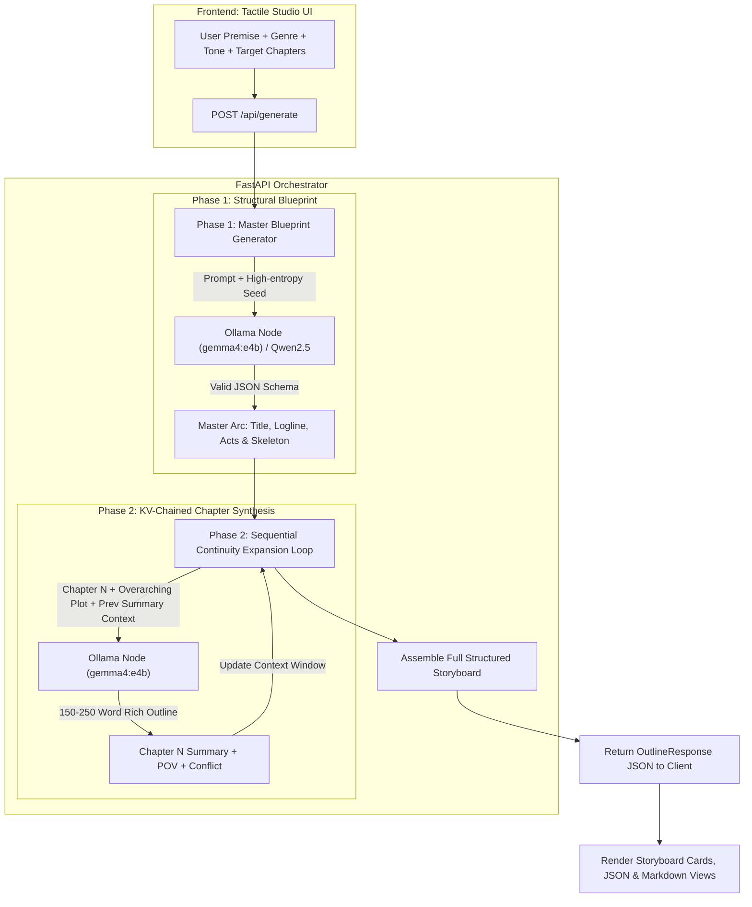

# NovelCraft System Architecture & AI Dramaturgy Engine

NovelCraft is an end-to-end generative AI system engineered specifically for long-form narrative planning, multi-chapter pacing, and dramatic story structuring.

---

## 1. The Core Challenge of Narrative LLMs

Standard Large Language Models struggle with long-form storytelling due to two fundamental architectural constraints:

1. **Context Window & Response Truncation Limits**: Asking an LLM to generate 15 to 25 detailed chapters in a single forward pass forces extreme compression. Summaries degrade into 1-sentence blurbs, losing nuance, tone, and character arcs.
2. **Contextual Drift (Amnesia)**: In single-pass generation, late-act chapters often forget critical plot devices, character vows, or inciting incidents introduced in Act I.

---

## 2. The Two-Phase Distributed Synthesis Pipeline

NovelCraft solves this via a **Two-Phase Distributed Chaining Protocol**:

### Phase 1: Macro-Narrative Blueprint
- The model generates the overarching 3-Act Campbellian structure:
  - **Act I (Departure)**: Setup, Inciting Incident, Call to Adventure, Threshold Cross.
  - **Act II (Initiation / Complication)**: Rising Tension, Midpoint Climax, Crisis of Faith, Dark Night of the Soul.
  - **Act III (Return / Resolution)**: Final Reckoning, Climax, Falling Action, Legacy Renewal.

### Phase 2: Micro-Chapter Sequential Expansion
- Iterates sequentially through all $N$ chapters.
- The prompt dynamically injects the **exact narrative summary of Chapter $N-1$** and the master logline, enforcing strict cause-and-effect continuity without token truncation.

---

## 3. Supervised Fine-Tuning (SFT) with QLoRA

For localized self-hosted inference without remote Ollama nodes, NovelCraft includes a complete QLoRA pipeline:

$$\text{Quantization: } \mathbf{W}^{\text{4-bit}} = \text{NF4}(\mathbf{W}) + \mathbf{S} \cdot (\mathbf{B} \mathbf{A})$$

- **Base Model**: `Qwen/Qwen2.5-1.5B-Instruct`
- **Adapter Configuration**:
  - Rank ($r$): 16
  - Scaling factor ($\alpha$): 32
  - Target Modules: `q_proj`, `v_proj`, `k_proj`, `o_proj`, `gate_proj`, `up_proj`
  - VRAM Footprint: ~1.45 GB VRAM with `bitsandbytes` 4-bit NormalFloat4 (`nf4`).

---

## 4. Reinforcement Learning from Human Feedback (RLHF - PPO)

NovelCraft includes an optional PPO alignment stage with a KL-divergence penalty to ensure adherence to user-provided dramatic constraints:

$$\mathcal{L}_{\text{PPO}}(\theta) = \hat{\mathbb{E}}_t \left[ \min\left(r_t(\theta)\hat{A}_t, \text{clip}(r_t(\theta), 1-\epsilon, 1+\epsilon)\hat{A}_t\right) \right] - \beta D_{\text{KL}}(\pi_\theta \parallel \pi_{\text{ref}})$$

Where:
- $\beta = 0.05$ (`kl_coef`) controls drift from the SFT policy.
- The Reward Model evaluates premise adherence, dramatic conflict resolution, and pacing quality.
